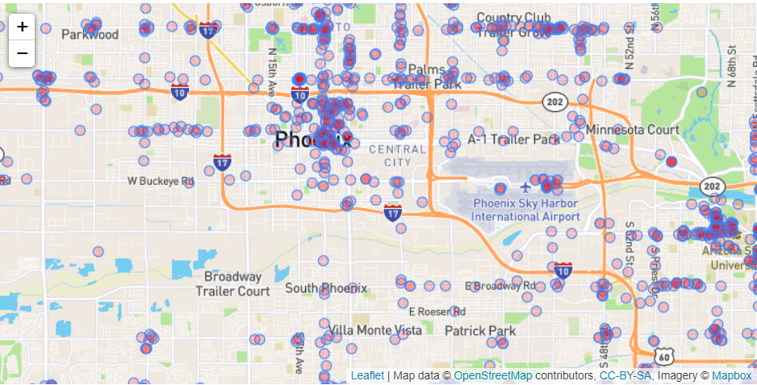
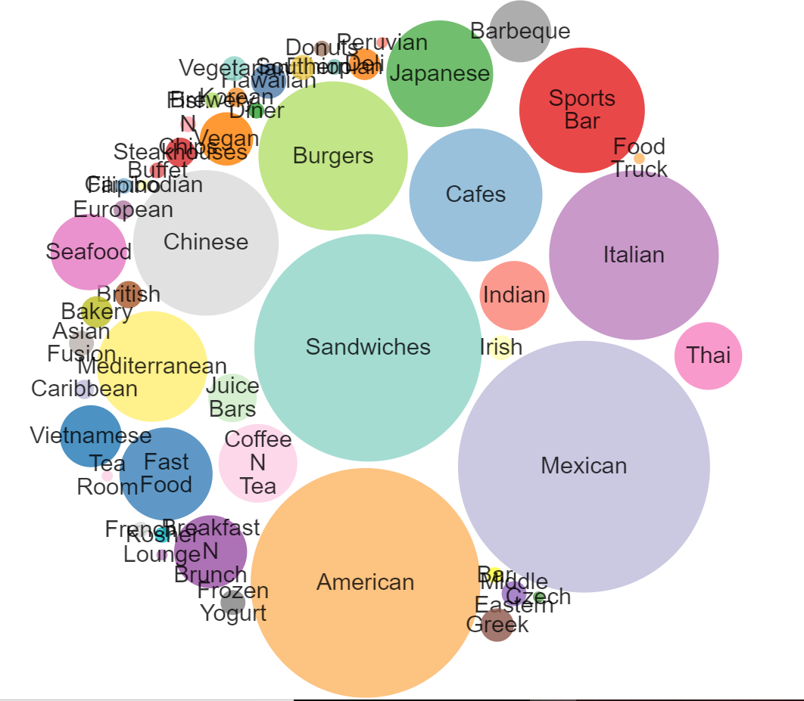
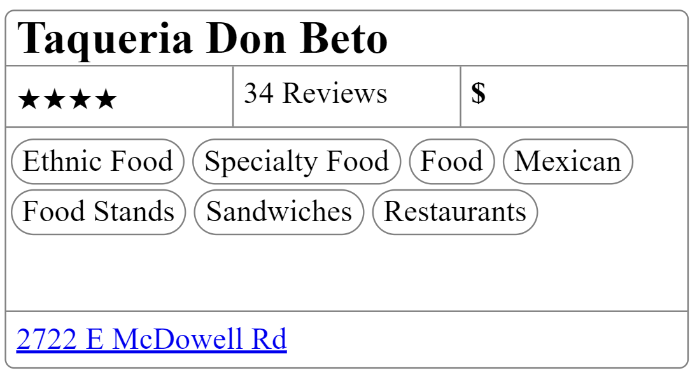
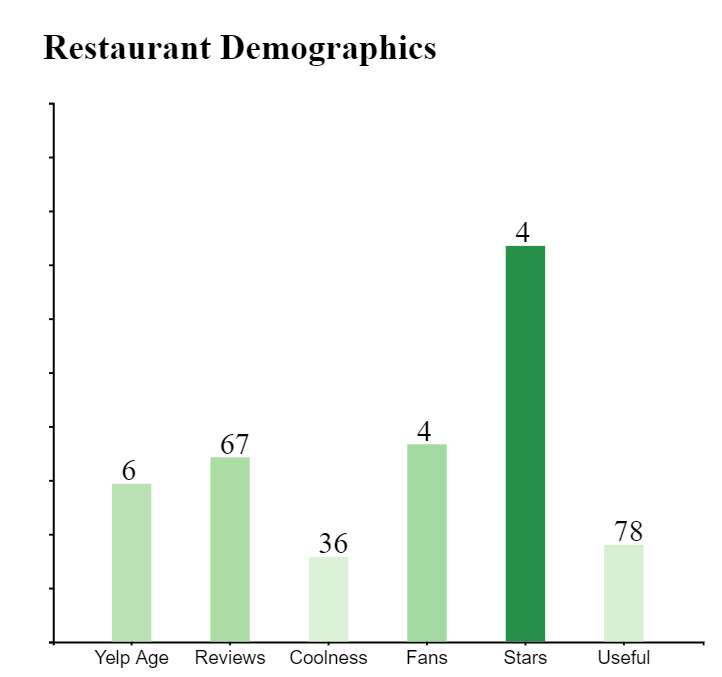
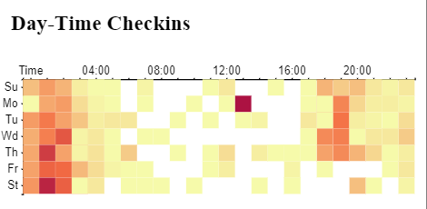
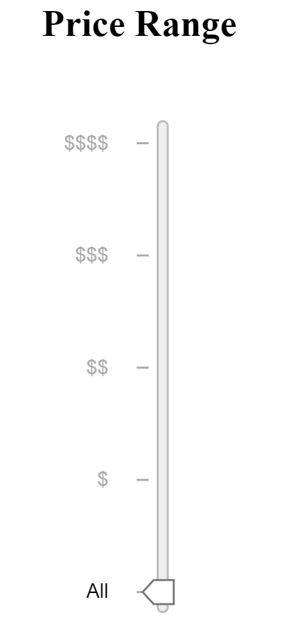
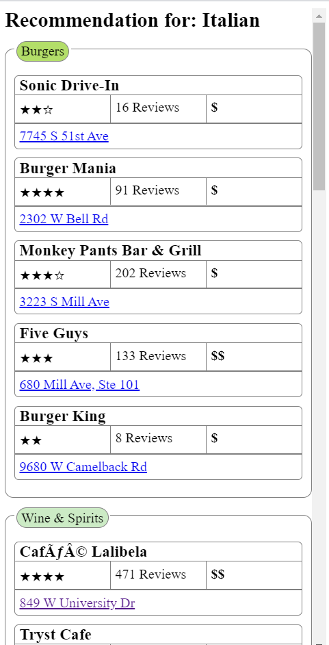
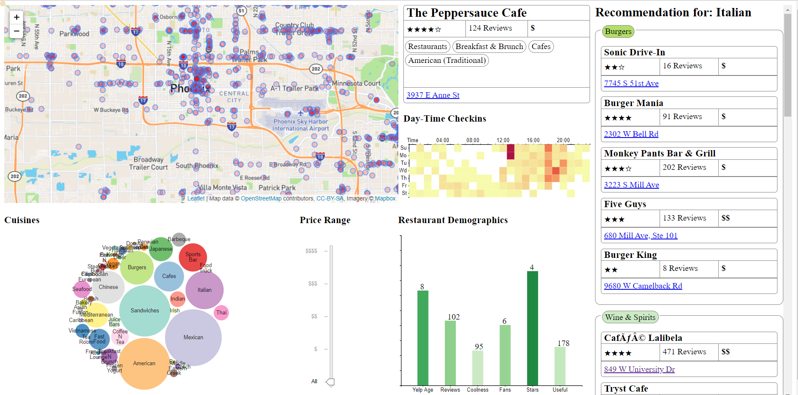

Final Project - Yelp Dataset Visualization  
===

[Demo Link]( https://vishaldodiya.github.io/dv-project/)

### Team Members
* Akshay Shah - cshah4@asu.edu
* Chirag Bhansali - cbhansal@asu.edu
* Prajeet Bhavsar - pdbhavsa@asu.edu
* Smarita Sharma - sshar173@asu.edu
* Vishal Dodiya - vmdodiya@asu.edu

In this project, we visualized restaurants data in Phoenix. We want to provide a better user experience for selecting restaurants, recommending them cuisine/ category which matches closely with the selected one. Show user related details for a restaurant and a bubble chart for depicting the category/ cuisines present in the region.

### Map functions

We first put all restaurants data on map of phoenix. The color of the circles is mapped to average rating of the restaurant. User is able to drag and zoom the map. We added this feature because location is often an important factor when picking restaurants. People are often interested to know what is around their area, which restaurants are there, their reviews and rating as well as what opinion does other fellow users have for that business.

### Bubble chart

The bottom panel offers the filter functions. We use a bubble chart to filter category/ cuisines. The size of the bubbles are mapped to the number of restaurants that have this category label. The benefit of this design is that it is a filter but at the same time, user is able to have a bigger picture of the distribution of the businesses. Click an element in the bubble will filter restaurants on the map. 

### User and business related info

When a user hovers over a specific restaurant, the user and business related info are populated on the right side of the map, with business info as the price level, category the business belongs to, address as well as the number of reviews the business has received.
User info plays a vital role in building other users trust as well as to attract their attention. People tend to eat at those restaurants which are trending as well as which have good reviews, review counts and more users visiting that place. We are showing the average for the user yelp age, i.e. how long a user visiting that restaurant has been using the yelp application, their average coolness, review rating, fans, usefulness of their reviews and stars given to the review.

### HeatMap

We are showing a heatmap for the checkin related info for a specific restaurant, when hovered over it. We observed that for majority of the business with 3.5 or above ratings, user checked in during the midnight hours (midnight to 4 am) which certainly shows why those restaurants are so popular and the user's excitment and willingness to stay up late to checkin.

### Price Range

There is a price range filter, which the user can use to filter out the restaurants in the selected region based on the number of dollars signs, the more the dollar signs, the more expensive the restaurant is.

### Intelligence

We are recommending cuisine and restaurants based on the cuisine selected from the bubble chart, as well as plot the recommended ones on the map with a color shade. If the user hover over any of the recommended restaurant in either the map or over the restaurant suggestion on the right side of the page, they can view the details of that business along with the user details, cuisines, and checkin heatmap of that restaurant.

### Final design

This is our final design and all the interaction part were described in the previous sections.

### references
https://www.yelp.com/dataset/documentation/main

